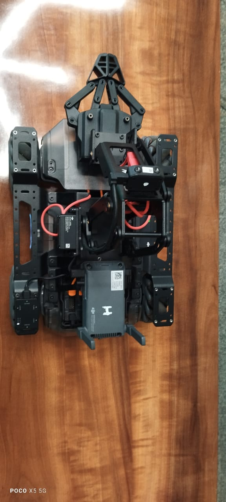
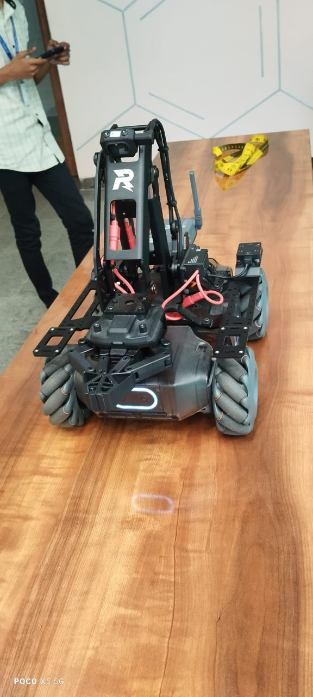
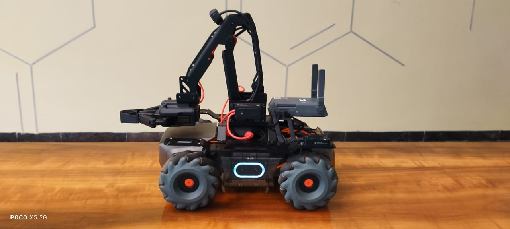
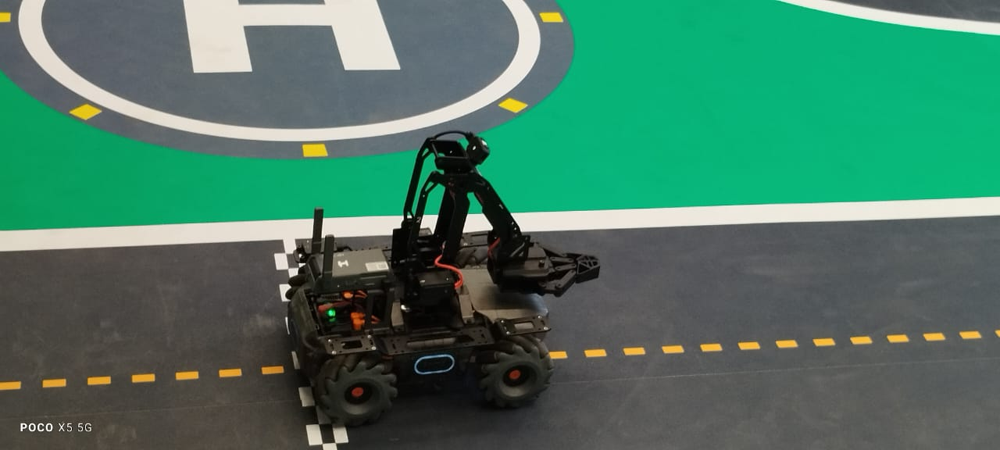

# MobileRobot-Openloopcontrol
## Aim:

To develop a python control code to move the mobilerobot along the predefined path.

## Equipments Required:
1. RoboMaster EP core
2. Python 3.7

## Procedure

Step1:
Initiate the mobile robot

<br/>

Step2:
Connect your PC with Moblie Robot through Wi-Fi

<br/>

Step3:
Open batter_level.py file and check the battery
<br/>

Step4:
Open the other python file and program the movements of robot using python
<br/>

Step5:
Execute the program and record the movements

<br/>

## Program
```python
from robomaster import robot
import time

if __name__ == '__main__':
    ep_robot = robot.Robot()
    ep_robot.initialize(conn_type="ap")

    ep_chassis = ep_robot.chassis
 ep_led = ep_robot.led
    ep_camera = ep_robot.camera

    print("Video streaming started.....")
    ep_camera.start_video_stream(display=True, resolution = camera.STREAM_360P)

    ep_chassis.move(x=2.55, y=0, z=0, xy_speed=1.5).wait_for_completed()
    ep_led.set_led(comp = "all",r=255,g=0,b=0,effect="on")

    ep_chassis.move(x=0, y=0, z=80, xy_speed=0).wait_for_completed()
    ep_led.set_led(comp = "all",r=0,g=255,b=0,effect="on")

    ep_chassis.move(x=1, y=0, z=0, xy_speed=1.5).wait_for_completed()
    ep_led.set_led(comp = "all",r=153,g=153,b=225,effect="on")

    ep_chassis.move(x=0, y=-1.4, z=0, xy_speed=1.5).wait_for_completed()
    ep_led.set_led(comp = "all",r=0,g=0,b=128,effect="on")

    ep_chassis.move(x=0, y=0, z=60, xy_speed=1.5).wait_for_completed()
    ep_led.set_led(comp = "all",r=192,g=192,b=192,effect="on")

    ep_chassis.move(x=1.5, y=0, z=0, xy_speed=1.5).wait_for_completed()
    ep_led.set_led(comp = "all",r=225,g=225,b=0,effect="on")

    ep_chassis.move(x=0, y=0, z=45, xy_speed=1.5).wait_for_completed()
    ep_led.set_led(comp = "all",r=225,g=225,b=0,effect="on")

    ep_chassis.move(x=1.45, y=0, z=0, xy_speed=1.5).wait_for_completed()
    ep_led.set_led(comp = "all",r=0,g=225,b=225,effect="on")

    ep_chassis.move(x=0, y=0, z=3, xy_speed=1.5).wait_for_completed()
    ep_led.set_led(comp = "all",r=153,g=153,b=225,effect="on")

    ep_chassis.move(x=0, y=-2.1, z=0, xy_speed=1.2).wait_for_completed()
    ep_led.set_led(comp = "all",r=0,g=0,b=128,effect="on")

     ep_chassis.move(x=0, y=0, z=170, xy_speed=1.5).wait_for_completed()
    ep_led.set_led(comp = "all",r=0,g=225,b=0,effect="on")

    ep_chassis.move(x=0.6, y=0, z=0, xy_speed=1.5).wait_for_completed()
    ep_led.set_led(comp = "all",r=255,g=255,b=0,effect="on")

    ep_chassis.move(x=0, y=0, z=0, xy_speed=1.5).wait_for_completed()
    ep_led.set_led(comp = "all",r=51,g=51,b=51,effect="on")

    time.sleep(4)
    ep_camera.stop_video_stream()
    print("Stopped video streaming.....")

    ep_robot.close()

```

## MobileRobot Movement Image:








<br/>
<br/>
<br/>
<br/>

## MobileRobot Movement Video:
https://youtu.be/dUtd1FnMlwY?si=_v3S-ukKMnpdri4x


[]

<br/>
<br/>
<br/>
<br/>

## Result:
Thus the python program code is developed to move the mobilerobot in the predefined path.


<br/>
<br/>

```
Mobile Robotics Laboratory
Department of Artificial Intelligence and Data Science/ Machine Learning
Saveetha Engineering College
```
